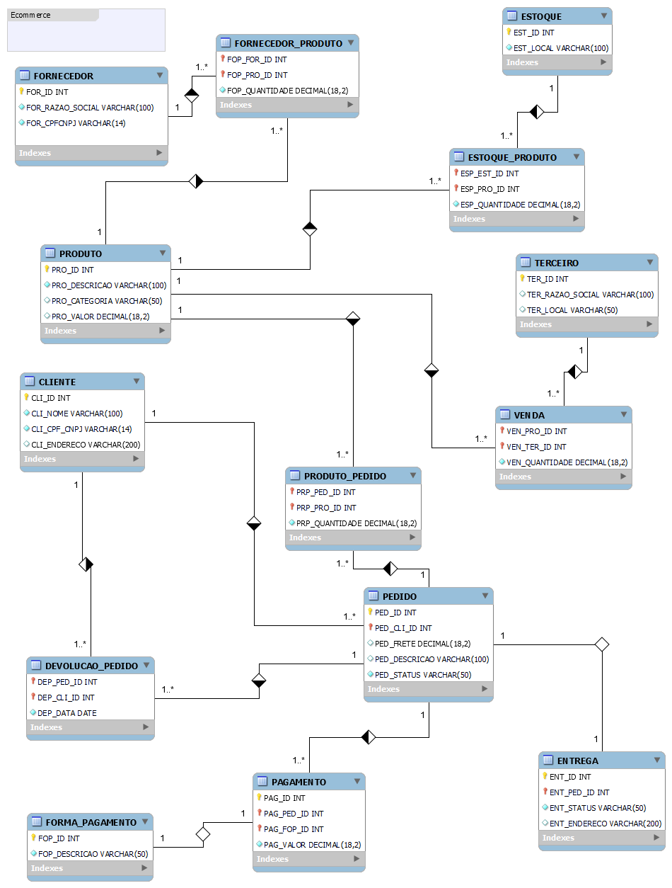

# Modelo conceitual e ER de Ecommerce
Desafio do bootcamp da DIO referente ao bootcamp Database Experience, que tem por objetivo a construção de um modelo lógico de banco de dados referente a um Ecommerce.
As etapas são a construção de um modelo em alto nível com a visão de mini mundo denominado diagrama conceitual e posteriormente o mapeamento deste modelo para um modelo (ER) entidade / relacionamento. 

## Objetivo:

Refine o modelo apresentado acrescentando os seguintes pontos:

 - Cliente PJ e PF – Uma conta pode ser PJ ou PF, mas não pode ter as duas informações;
 - Pagamento – Pode ter cadastrado mais de uma forma de pagamento;
 - Entrega – Possui status e código de rastreio;

## Narrativa do escopo: 

### Produto
- Os produtos são vendidos por uma única plataforma online. Contudo estes podem ter vendedores distintos (terceiros); 
- Cada produto possui um fornecedor;
- Um ou mais produtos podem compor o pedido; 

### Cliente
 - O cliente pode se cadastrar no site com o CPF ou CNPJ;
 - O endereço do cliente irá determinar o valor do frete; 
 - Um cliente pode comprar mais de um pedido. Este tem um período de carência para a devolução do produto; 

 ### Pedido 
 - Os pedidos são criados por clientes e possuem informações de compra, endereço e status da entrega;
 - Um produto ou mais compoem o pedido;
 - O pedido pode ser cancelado;

## Detalhes

### diretório modelo
Arquivo utilizado para construção do modelo conceitual.
Arquivo utilizado para construção do modelo ER.

### modelo conceitual 
Foi utilizado a ferramenta *Draw.io* para a construção.

### modelo ER entidade relacionamento
Para o modelo ER foi utilizado uma sigla de 3 caracteres que identifica cada tabela. 
Esta sigla irá preceder cada nome de coluna de forma que o nome da coluna nunca se repita em qualquer tabela. 

#### sigla x tabela 
|sigla |tabela                              |
   --- |                                --- |
|CLI   | CLIENTE                            |
|DEP   | DEVOLUÇÃO_PEDIDO                   |
|ENT   | ENTREGA                            |
|EST   | ESTOQUE                            |
|ESP   | ESTOQUE_PRODUTO                    |
|FOP   | FORMA_PAGAMENTO                    |
|FOR   | FORNECEDOR                         |
|FOP   | FORNECEDOR_PRODUTO                 |
|PAG   | PAGAMENTO                          |
|PED   | PEDIDO                             |
|PRO   | PRODUTO                            |
|PRP   | PRODUTO_PEDIDO                     |
|TER   | TERCEIRO                           |
|VEN   | VENDA                              |

Foi utilizado a ferramenta *Mysql Workbench* para a construção.

## Referências
- Ferramenta de construção de diagramas **[Draw.io](https://app.diagrams.net/)**:  
<https://app.diagrams.net/>

- Ferramenta utilizada para construção do modelo ER (entidade x relacionamento) **[Mysql Workbench](https://www.mysql.com/products/workbench/)**:  
<https://www.mysql.com/products/workbench/>

